# STEP 4B · Databricks Apps 에서 agent 앱 배포 (driver-proxy 직접 호출)

**이 단계에서 하는 일**: Databricks Apps 에 agent 앱을 배포해, **AI Gateway 엔드포인트 없이** 드라이버의 vLLM 을 driver-proxy 로 직접 호출합니다. 도구 호출(function calling) 루프까지 도는 앱이 남습니다.  
**하는 방법 두 가지**: **[4-A · UI 로만](#4-a-ui-로-하기-화면-그대로-따라하기)**(화면 캡처로 그대로 따라할 수 있습니다 — secret 저장만 CLI) 또는 **[4-B · CLI](#4-b-cli-로-하기)**. 결과는 같습니다.  
**소요 시간**: **약 12분** — 앱 생성 약 3분 + PAT·secret 약 2분 + 소스 업로드·배포 **5~6초** + 자기시험 약 5분(vLLM 이 이미 떠 있는 경우). 단계별 참고값은 §6  
**끝났는지 판단하는 기준**: 앱의 자기시험 결과 `verdict` 가 **`PASS_`** 로 시작하고, `T4_agent_tool_loop.ok` 가 **`true`**, `T5_negative_404` 가 **404 이면서 본문이 `{"detail":"Not Found"}`** 일 때(상태코드만으로 판단하지 마십시오 — 자세한 기준은 §5.1). 앱 상태가 `RUNNING` 인 것만으로도 판단하지 마십시오 — 상류 vLLM 이 죽어도 앱은 `RUNNING` 입니다.  
**전제**: [STEP3_vllm_serve.md](STEP3_vllm_serve.md) 까지 끝나 **`--host 0.0.0.0`** 과 **tool calling 플래그**로 vLLM 이 떠 있는 상태. 계정 관리자 권한은 **필요 없습니다**.

**이 문서의 자리표시자** — 아래 4개는 고객 환경 값으로 바꿔 넣으십시오.

| 자리표시자 | 뜻 | 확인 방법 |
|---|---|---|
| `<PROFILE>` | Databricks CLI 프로파일 이름 | `databricks auth login` 으로 만든 이름. 목록은 `databricks auth profiles`. **UI 경로(4-A)에서도 §3.3(secret 저장)에는 반드시 필요합니다** — 그 단계만 UI 가 없습니다 |
| `<워크스페이스>` | 워크스페이스 FQDN | 브라우저 주소창의 호스트(예: `adb-0000000000000000.0.azuredatabricks.net`) |
| `<클러스터ID>` | vLLM 이 도는 클러스터 ID | Compute → 클러스터 → URL 끝부분, 또는 `databricks clusters list --profile <PROFILE>` |
| `<사용자>` | 워크스페이스 사용자명 | `databricks current-user me --profile <PROFILE>` 가 돌려주는 사용자명. Workspace 화면의 홈 폴더 경로(`/Users/…`)와 같은 값입니다 |

> **STEP4 와 STEP4B 는 둘 중 하나만 하면 됩니다.** 게이트웨이 엔드포인트가 필요하면 [STEP4](STEP4_ai_gateway.md),
> 앱 하나만 필요하면 이 문서입니다. 둘 다 해도 서로 방해하지 않습니다(같은 vLLM 을 씁니다).

---

## 1. 이 경로는 무엇인가

```
사용자 브라우저 (SSO)                      Databricks Apps 가 인증을 처리
        ▼
https://<앱이름>-<워크스페이스ID>.<리전>.azure.databricksapps.com
        │   앱 = serverless 컴퓨트에서 도는 python 프로세스
        │   agent 루프 · 도구 호출 · 업무 로직이 여기 있습니다
        ▼   Authorization: Bearer <secret 으로 주입한 PAT>
https://<워크스페이스>/driver-proxy-api/o/<조직ID>/<클러스터ID>/8005/v1/chat/completions
        ▼   driver-proxy (드라이버 사설 IP 로 접속)
드라이버의 vLLM (0.0.0.0:8005)
```

### STEP4(게이트웨이)와 비교

| 항목 | STEP4 · AI Gateway 엔드포인트 | **STEP4B · Databricks Apps** |
|---|---|---|
| 만들어지는 것 | OpenAI 호환 URL 1개 | 웹 앱 1개(+ 그 안의 agent) |
| 호출 한도 · 사용량 추적 | **있음**(게이트웨이 계층) | **없음** — 필요하면 앱 코드에서 구현 |
| AI Playground 노출 | **됨** | 안 됨 |
| 외부 시스템이 붙기 | 쉬움(URL 하나) | 앱이 API 를 따로 열어야 함 |
| 사용자 인증 | 호출자 토큰 관리 필요 | **Apps 가 SSO 로 처리**(권한은 앱 단위) |
| serverless egress 제한 환경 | **차단됨**(`CUSTOMER_UNAUTHORIZED` · [A4](appendix/A4_serverless_egress_allowlist.md)) | **정책 변경 없이 동작**(§10 실측) |
| PAT 를 두는 곳 | 엔드포인트의 secret | 앱의 secret 리소스 |

**egress 정책이 제한된 워크스페이스에서 게이트웨이가 막혔다면 이 경로가 실증된 대안입니다.** 근거는 §10.

---

## 2. 시작 전 한 가지 — 인증은 **PAT** 로 합니다

앱에서 driver-proxy 를 호출할 때 쓸 수 있는 신원은 셋인데, **전용(single-user) 클러스터에서는
「클러스터 single user 의 PAT」 하나만 통과합니다.** 앱 서비스 프린시펄과 사용자 OBO 토큰은 둘 다 403 이고,
권한을 더 줘도 열리지 않습니다(권한 검사가 아니라 신원 검사입니다).

**그래서 이 문서는 §3 에서 PAT 를 발급해 secret 으로 주입합니다.** 세 신원의 실제 응답과 원인은
[§12 참고 — 신원별 응답](#12-참고--driver-proxy-신원별-응답)에 있습니다. 판정 전에 **클러스터를 기동해 두십시오** —
꺼져 있으면 인증 검사 전에 다른 오류가 돌아와 오판하게 됩니다.

클러스터를 전용(single-user) 모드에서 바꾸는 방법은 이 문서에서 권하지 않습니다 — 클러스터 격리를 포기하는
보안 통제 변경이고, **클러스터 재시작**을 수반해 `/local_disk0` 이 비워지므로 venv·가중치·serve 를 다시
올려야 합니다([STEP2](STEP2_cluster_and_runtime.md)).

---

## 3. PAT 발급과 secret 저장

driver-proxy 에 인증할 토큰입니다. **발급은 UI 에서, secret 저장은 CLI(또는 노트북)에서** 합니다 —
secret scope 는 UI 가 없습니다(§3.3).

> ⚠️ **토큰은 반드시 노트북 밖에서 발급하십시오.** 노트북 안에서 발급하면 새 토큰이 아니라 **노트북 컨텍스트에
> 묶인 토큰**이 반환되고, 그 토큰은 워크스페이스 내부에서는 200 이지만 **외부에서는 403** 입니다.
> 앱은 serverless 컴퓨트에서 도는 외부 호출자이므로 반드시 실패합니다. 판별법: `databricks tokens list`
> 결과에 그 토큰이 보이면 정상입니다. (STEP4 §3 과 같은 함정입니다.)

### 3.1 UI 에서 발급

**Settings → Developer → Access tokens** — 주소창에 바로 넣어도 됩니다:
`https://<워크스페이스>/settings/user/developer/access-tokens`

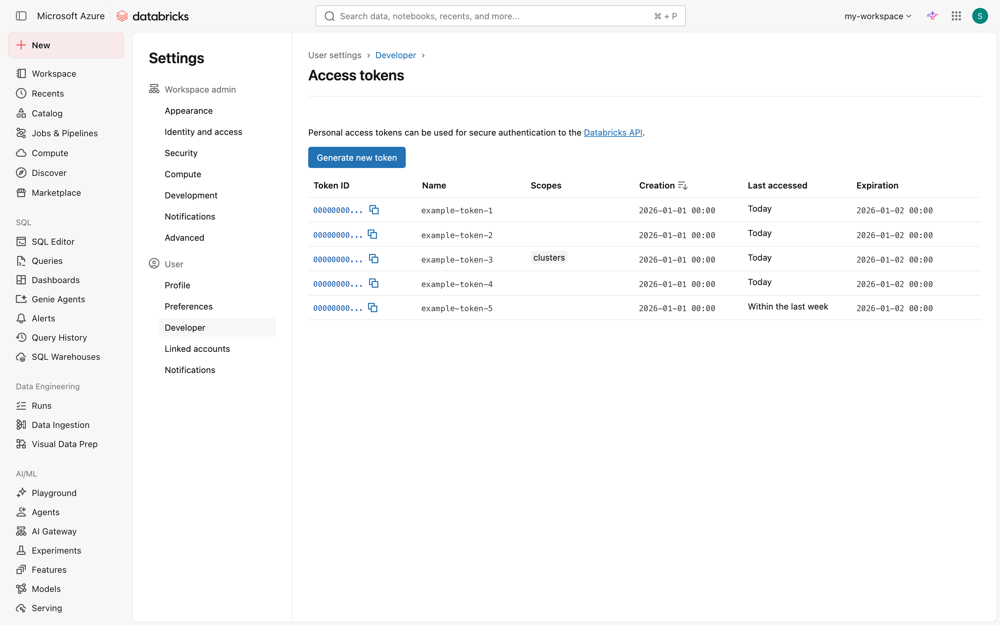

**Generate new token** 을 누르면 아래 4개를 묻습니다. 화면의 실제 라벨입니다.

| 필드 | 이 문서의 값 | 주의 |
|---|---|---|
| **Name** | 예: `qwen agent app driver-proxy` | `Comment` 가 아니라 **Name** 입니다 |
| **Lifetime (days)** | 짧게 두십시오 · 운영은 필요한 만큼 | 기본값은 **14** · 허용 범위 1~730 |
| **Scope** | `Other APIs` (기본 선택) | `BI Tools` 아님 |
| **API scope(s)** | **`clusters`** | **비워 둘 수 없습니다** — §3.2 |

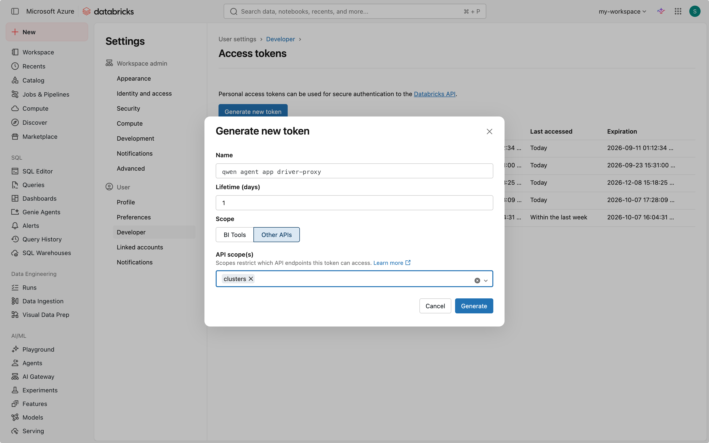

발급 직후 값이 한 번만 보이는 창이 뜹니다(`Make sure to copy the token now. You won't be able to see it
again.`). **그 자리에서 값을 복사해 두십시오** — 다시 볼 수 없습니다.

발급 후 목록에 **Scopes 열에 `clusters`** 가 붙은 행이 생깁니다.

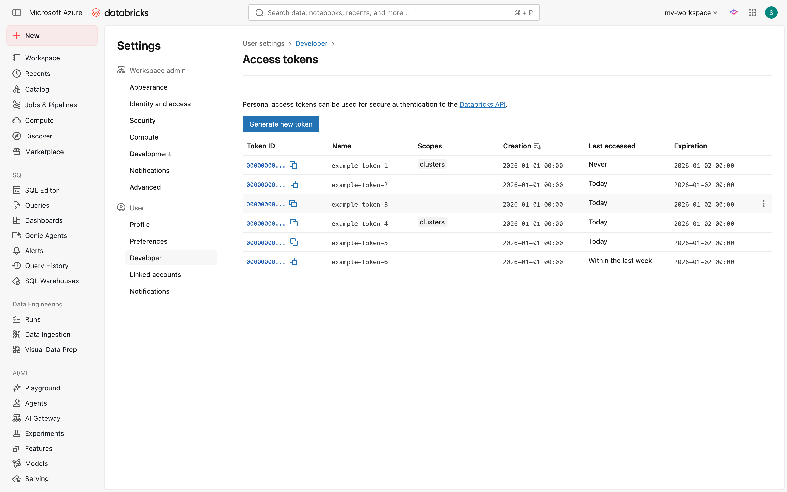

### 3.2 scope 는 `clusters` 하나로 충분합니다

UI 는 **API scope 를 반드시 하나 고르게 합니다**(고르지 않으면 `Generate` 가 비활성). 즉 "scope 를 지정하지
않은 PAT" 는 UI 로는 만들 수 없고, 그에 해당하는 선택지는 목록 맨 아래 **`all APIs (not recommended)`** 입니다.
**`clusters` 하나만 주십시오** — 그 조건으로 앱 경로 종단(도구 호출 루프까지)이 통과합니다.

**왜 `clusters` 하나로 되는가**: PAT 는 **driver-proxy 호출에만** 쓰입니다. 앱이 워크스페이스 API 를 부를 때
(예시 도구 `get_cluster_state`, 자기시험 결과 파일 기록)는 **앱 서비스 프린시펄** 신원을 씁니다 — 신원이
분리되어 있으므로 PAT 의 권한 표면을 최소로 유지할 수 있습니다.

> **`clusters` 는 "최소"지만 "좁지" 않습니다.** 이 scope 로 `clusters/get`·`list` 는 물론 **변경 계열도 인가를
> 통과**합니다(클러스터 재시작·종료 가능). 유출 시 영향 범위를 그렇게 보고 수명을 짧게 두십시오.

### 3.3 secret 저장 — 여기만 UI 가 없습니다

**secret scope 생성과 값 저장은 UI 로 할 수 없습니다.** CLI·API·노트북 SDK 만 가능합니다
(레거시 `#secrets/createScope` 페이지는 **Azure Key Vault 백엔드 scope 전용**이고 값 저장도 ACL 부여도 못 합니다).
이 문서에서 CLI 가 반드시 필요한 단계는 이것 하나입니다.

```bash
# ① secret scope 생성 (이미 있으면 건너뜁니다)
databricks secrets create-scope qwen-agent --profile <PROFILE>

# ② 저장 — 값을 물어보게 해서 셸 히스토리에 남기지 않습니다
databricks secrets put-secret qwen-agent driver_pat --profile <PROFILE>
```

`--string-value "<토큰>"` 으로 한 줄에 줄 수도 있지만 히스토리·프로세스 목록에 남습니다.

**수명을 정하십시오.** 만료되면 앱 화면은 그대로 뜨는데 `agent 실행`만 실패합니다(§8).
갱신 후에는 **반드시 앱을 재배포**하십시오 — `DRIVER_PAT` 는 기동 시점에 읽습니다.

---

## 4. 앱 만들기 · 소스 업로드 · 배포

**두 가지 길이 있습니다.** [4-A](#4-a-ui-로-하기-화면-그대로-따라하기) 는 **UI 로만** 하는 길이고
(secret 저장 §3.3 만 예외), [4-B](#4-b-cli-로-하기) 는 CLI 로 하는 길입니다. **결과는 같습니다** —
어느 쪽으로 만든 앱이든 도구 호출 루프까지 동작합니다. 화면을 그대로 따라가려면 4-A 를 쓰십시오.

> **먼저 확인**: 관리자가 **Settings → Development → Apps → "Only allow app deployments from Git"** 를
> 켜 두었다면 워크스페이스 폴더에서 배포하는 이 절차 전체가 막힙니다. 그 경우 Git 소스로 가십시오(§4-A.3 주석).

---

### 4-A. UI 로 하기 (화면 그대로 따라하기)

**아래 순서대로 하십시오.** 앱을 먼저 만들어 두면(컴퓨트 프로비저닝에 2~3분)
그 동안 소스 파일 작업을 할 수 있어 대기 시간이 겹쳐집니다. 배포(§4-A.5)는 컴퓨트가 `Active` 가 된 뒤에만 됩니다.

#### 4-A.1 앱 만들기 + secret 리소스 연결

**앱 목록**으로 갑니다. 주소는 **`https://<워크스페이스>/apps`** 이고, 열면 새 Apps 화면
**`/apps-v2`** 로 넘어갑니다(예전 `Compute → Apps` 가 아니라 **독립 화면**입니다. 워크스페이스로 돌아가려면
안내 띠의 **Use the app switcher ↗** 를 쓰십시오).

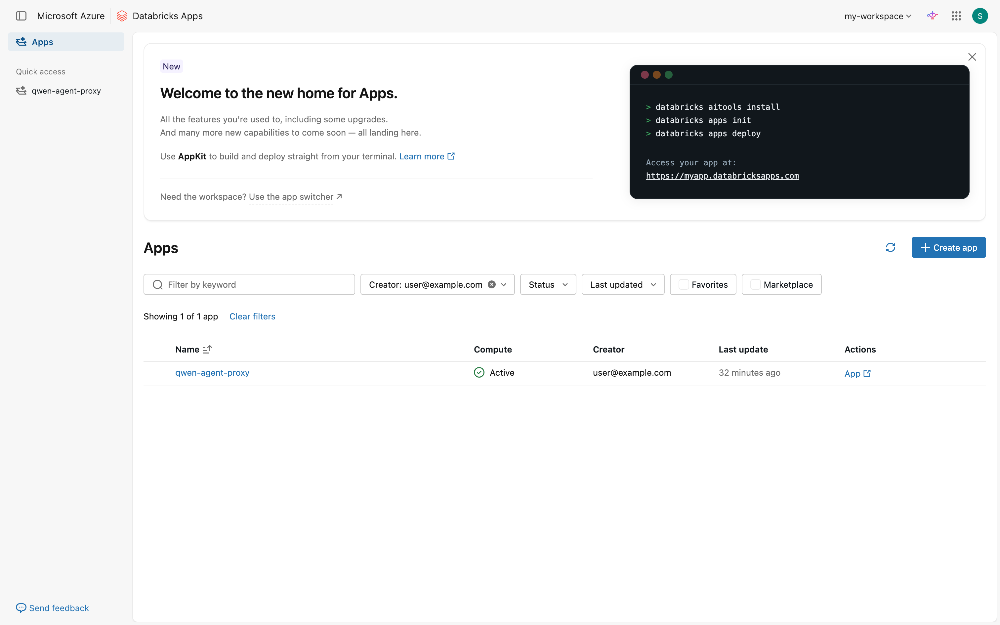

**Create app** → **Create a custom app** (템플릿 갤러리가 아니라 왼쪽 위 카드입니다).

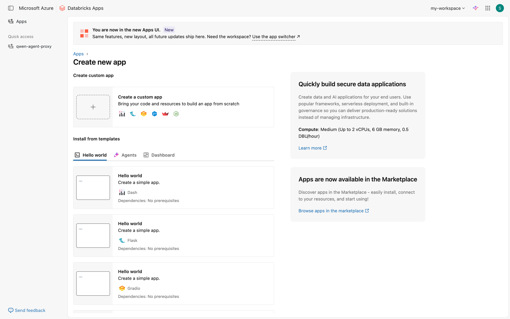

**1단계 Name app** — `App name` 은 **만든 뒤 바꿀 수 없고 앱 URL 에 들어갑니다.**

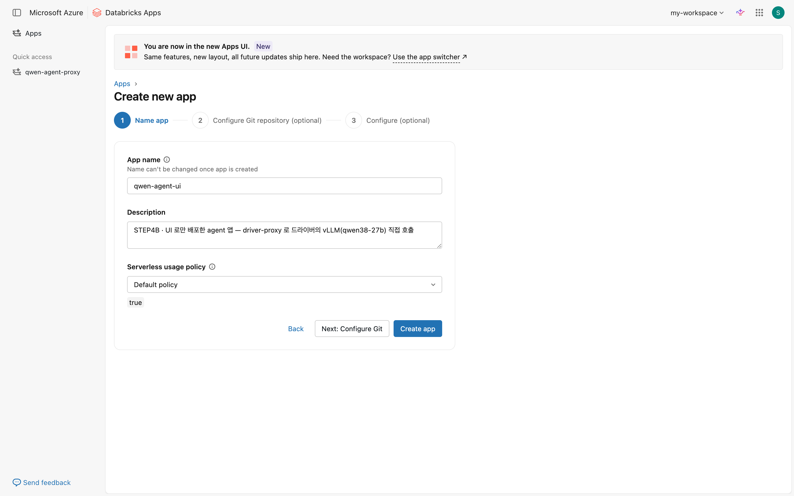

**2단계 Configure Git repository (optional)** — 워크스페이스 폴더에서 배포하므로 비워 두고 **Next: Configure**
(1단계의 버튼은 **Next: Configure Git** 입니다).

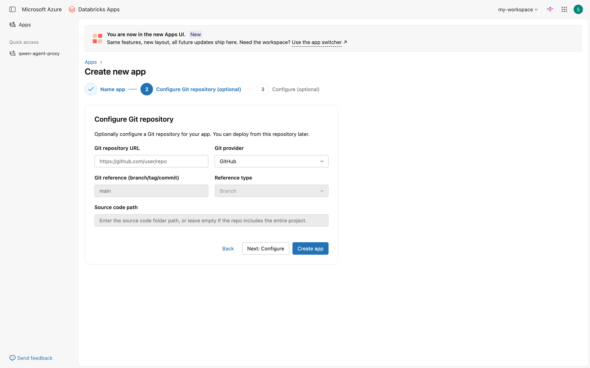

**3단계 Configure (optional)** — 여기가 핵심입니다. **App resources → Add resource → Secret**.

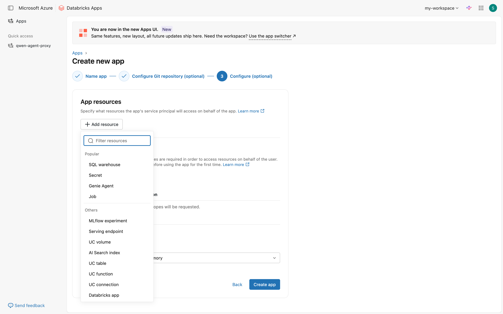

네 칸을 채웁니다.

| 화면의 칸 | 넣는 값 | 왜 |
|---|---|---|
| **Secret** 아래 첫 드롭다운(자리표시자 `Select scope`) | `qwen-agent` | secret scope |
| 두 번째 드롭다운(자리표시자 `Select secret key`) | `driver_pat` | scope 안의 키 |
| **Permission** | `Can read` | API 로는 `READ` |
| **Resource key** | **`driver_pat`** | ⛔ **기본값이 `secret` 입니다. 반드시 바꾸십시오** |

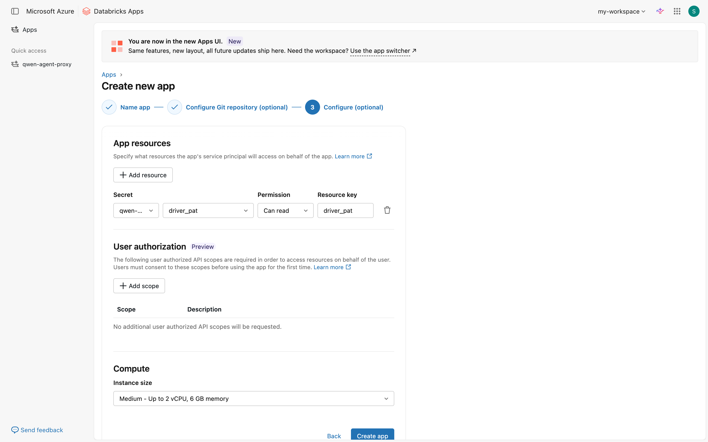

> ⛔ **`Resource key` 가 `app.yaml` 의 `valueFrom` 값과 글자 그대로 같아야 합니다.** 다르면 앱은 정상 기동하지만
> `DRIVER_PAT` 가 **빈 문자열**이 되고, 앱은 PAT 대신 **자기 서비스 프린시펄 신원**으로 driver-proxy 를 부르게 되어
> **모든 호출이 403**(`Single-user check failed`)이 됩니다. 증상 판별은 §8 과 앱 화면의 **신원 진단** 버튼.
> 이 칸은 secret 의 *키 이름*과는 무관합니다 — 이 문서에서 우연히 같은 이름을 쓴 것입니다.

`User authorization` 은 **아무것도 추가하지 마십시오**(그래도 앱을 처음 열 때 신원 확인 3항목 동의 화면은 뜹니다 — §5.3) — driver-proxy 가 요구하는 `clusters` 는 Apps 의
`user_api_scopes` 에 **없는 값**이고, 관리자 설정으로도 열 수 없습니다(§2). `Compute` 는 기본 **Medium** 으로 둡니다.

**Create app** 을 누르면 앱이 생기고 **컴퓨트 프로비저닝이 시작됩니다** —
화면에 `Compute is starting` · `Please wait for compute to become ready before deploying the app.
This process takes 2-3 minutes.` 가 뜹니다. **이 시점에는 아직 배포된 것이 아닙니다.**

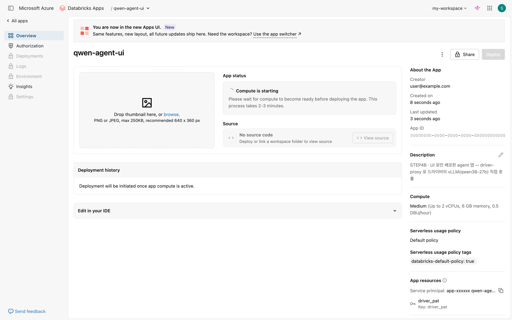

이 화면의 **App resources** 칸에 `driver_pat` 과 **Service principal: app-xxxxxx `<앱이름>`** 이 보입니다.
이 서비스 프린시펄이 다음 단계의 주체입니다(**Authorization** 탭에서도 볼 수 있습니다).

> **secret scope 의 READ 권한은 따로 주지 않아도 됩니다.** 마법사에서 리소스를 붙이면 앱 SP 에 `READ` 가
> 들어갑니다(확인: `databricks secrets list-acls qwen-agent --profile <PROFILE>`). 들어가 있지 않으면
> 4-B.2 의 `put-acl` 을 실행하십시오. 리소스를 붙이는 사람이 그 scope 에 `MANAGE` 를 갖고 있어야 합니다.

#### 4-A.2 소스 파일을 워크스페이스에 올리기

**Workspace** → 올릴 위치(예: 사용자 홈) → **Create** → **Folder** 로 폴더를 하나 만듭니다
(이 문서의 실측 폴더명은 `qwen_agent_app_ui`).

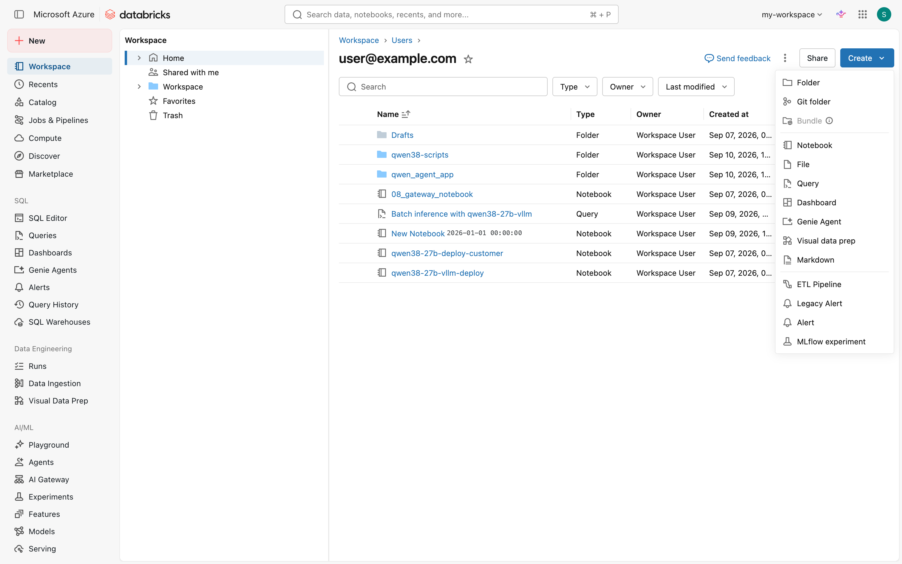

만든 폴더로 들어가 폴더 이름 옆 **⋮ (Folder actions)** → **Import** 를 누릅니다.

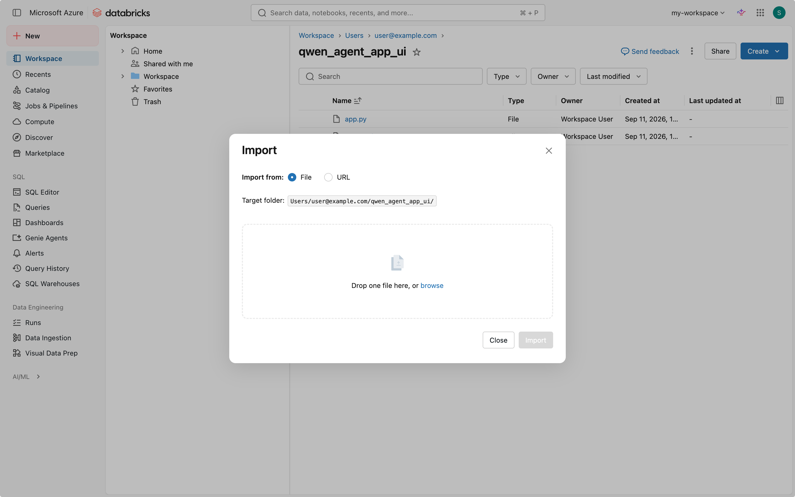

창의 **`browse`** 로 `apps/agent_app/app.py` 를 고르고 **Import**, 같은 방법으로 `app.yaml` 을 한 번 더 올립니다
(**한 번에 한 파일**입니다 — 위 창에 `Drop one file here, or browse` 라고 적혀 있습니다).
파일을 고르면 창이 아래처럼 바뀝니다(파일명·크기·`Remove file`).

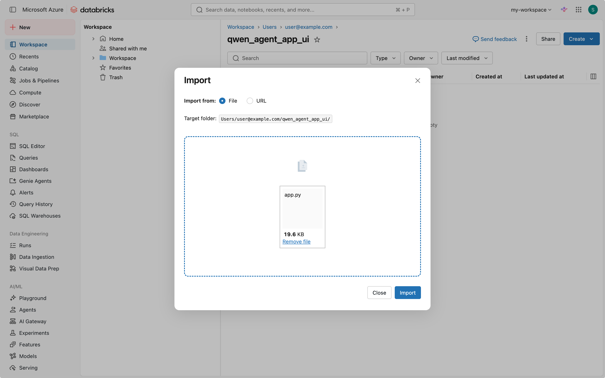

> **UI Import 에는 파일 형식을 고르는 선택지가 없습니다 — 필요하지 않습니다.** 워크스페이스가 내용을 보고
> 판정하며, `app.py`·`app.yaml` 은 그대로 **파일(FILE)** 로 들어옵니다.
> 확인이 필요하면 `databricks workspace list <폴더> -o json --profile <PROFILE>` 의 `object_type` 이
> 전부 **`FILE`** 인지 보십시오.

#### 4-A.3 `app.yaml` 의 클러스터 ID 를 화면에서 고치기

패키지의 `app.yaml` 은 `VLLM_CLUSTER_ID` 가 **자리표시자**(`"<클러스터ID>"`)입니다. 올린 파일을 클릭하면
워크스페이스 편집기가 열립니다(노트북이 아니라 평범한 편집기 — 셀도 Connect 도 없습니다).

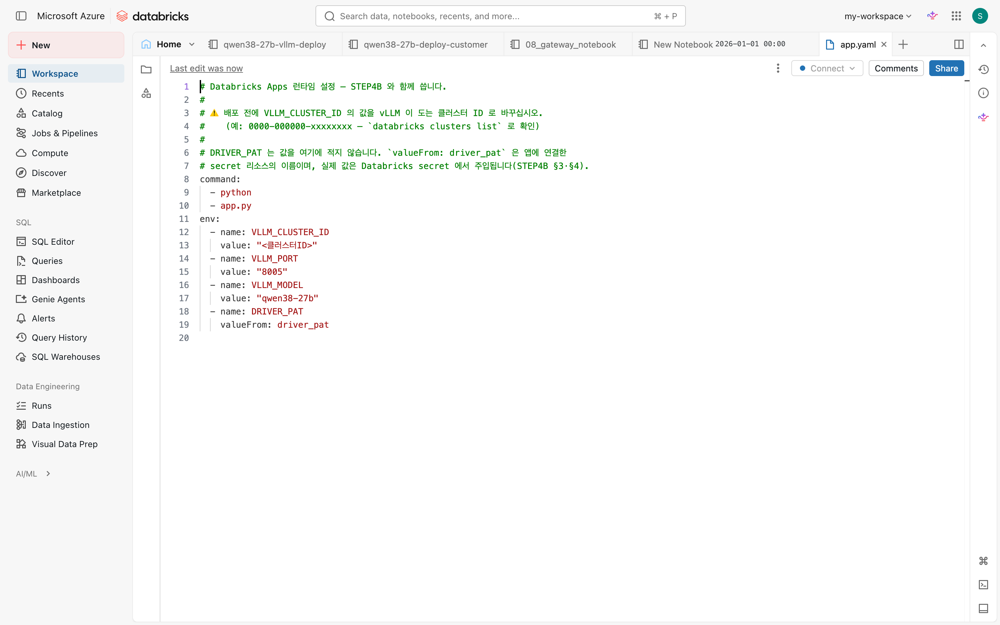

값을 vLLM 이 도는 클러스터 ID 로 바꿉니다. **저장 버튼은 없습니다 — 자동 저장**입니다(화면의 `Last edit was …` 가 저장 표시입니다).

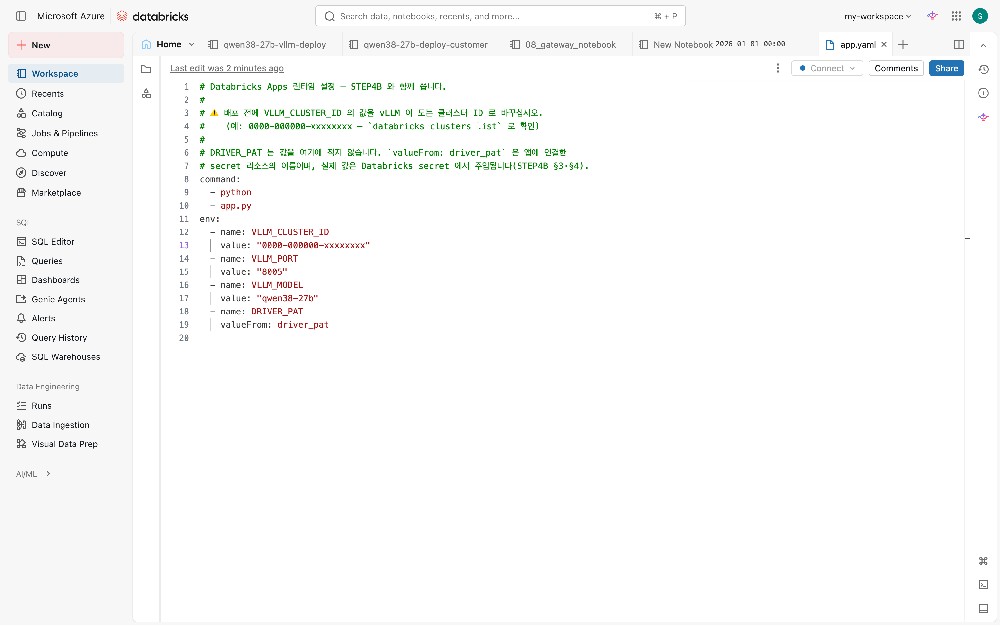

> **파일을 고쳐도 도는 앱은 바뀌지 않습니다.** 배포는 그 시점의 **복사본**을 씁니다 —
> 고칠 때마다 **다시 Deploy**(§4-A.5) 해야 반영됩니다.
> Git 소스로 하려면 앱 생성 2단계(`Configure Git repository`)나 앱 화면의 **Deploy → From Git** 을 쓰십시오.

#### 4-A.4 클러스터 권한 — 예시 도구를 쓸 때만

앱의 예시 도구 `get_cluster_state` 가 `clusters/get` 을 부르므로, **앱 SP** 에 클러스터
**`CAN ATTACH TO`** 를 줍니다. **Compute → 클러스터 → 우측 상단 ⋮(More) → Permissions**.

`Select user, group or service principal…` 에 앱 이름을 넣으면 `app-xxxxxx <앱이름>` 이 나옵니다.
권한을 **`Can Attach To`** 로 바꾸고(**기본값이 `Can Manage`** 이므로 반드시 바꾸십시오) **Add → Save**.

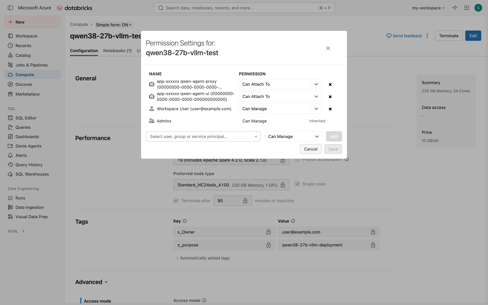

> **이 권한은 driver-proxy 403 을 고치지 못합니다.** 전용(single-user) 클러스터의 driver-proxy 는 권한이 아니라
> **신원**을 봅니다(§2). 도구를 쓰지 않는다면 이 단계는 건너뛰어도 앱은 동작합니다.

#### 4-A.5 배포

컴퓨트가 **Active** 가 되면 앱 화면 오른쪽 위 **Deploy** 가 살아납니다. 이때 앱 상태는 아직
`Unavailable` · `No source code` 입니다.

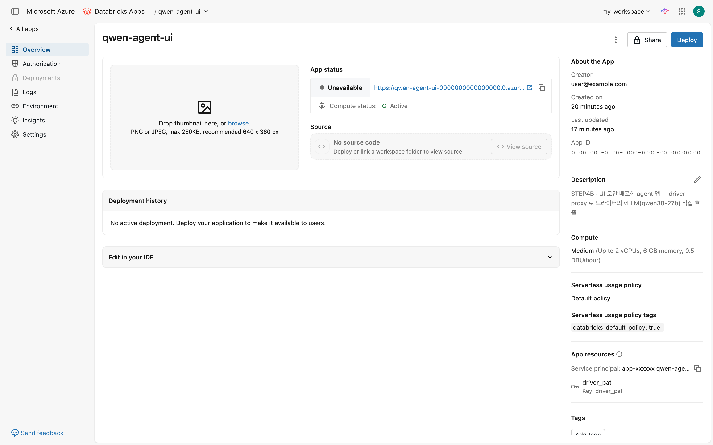

**Deploy** → `Create deployment` 창의 **입력란**(라벨이 붙어 있지 않습니다)에 §4-A.2 에서 만든 폴더의
**`/Workspace/` 로 시작하는 전체 경로**를 넣고 **Deploy**. 오른쪽 폴더 아이콘으로 골라도 됩니다.

> **두 번째 배포부터는 이 창이 뜨지 않습니다** — 소스 경로가 앱에 연결돼 있으므로 **Deploy** 를 누르면
> 바로 같은 경로로 재배포됩니다(실측 4회).

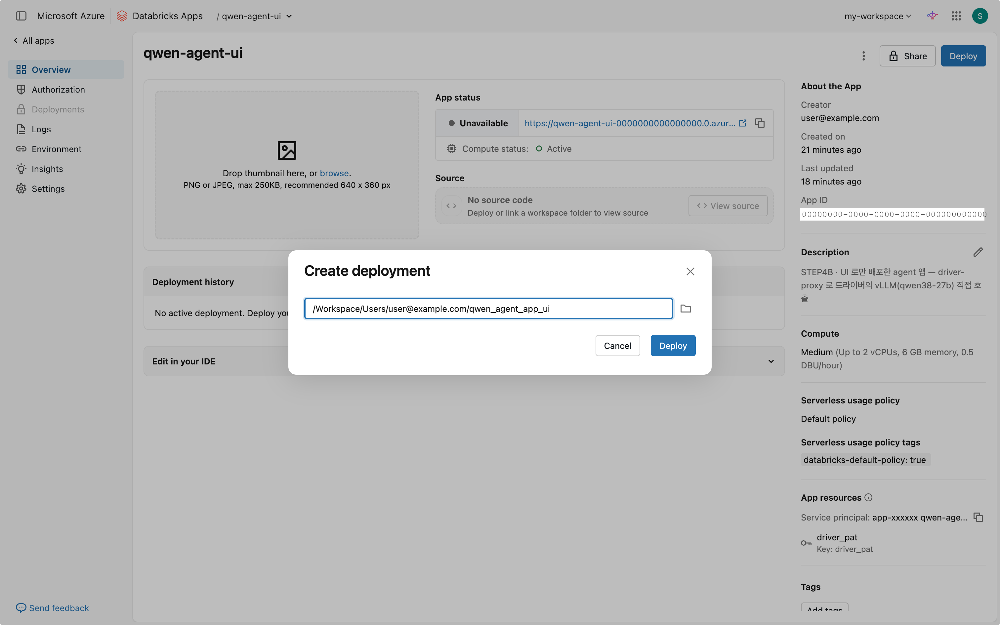

**약 6초**에 끝납니다. 끝나면 화면에 `App status: Running` ·
`Compute status: Active` · `Source` 에 그 경로가 표시됩니다. 배포 상태 문자열 `SUCCEEDED` 와 메시지
`App started successfully` 는 **화면이 아니라 API** 에서 보입니다(`databricks apps get <앱> -o json`).

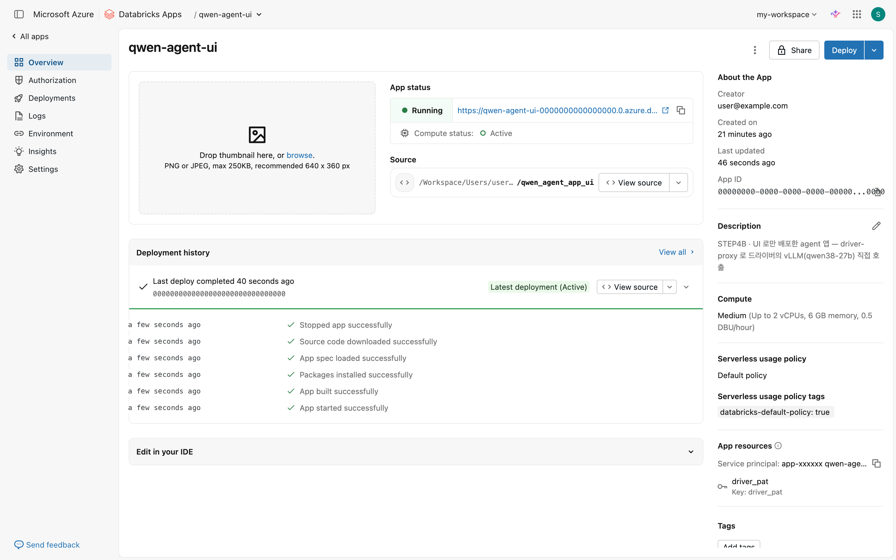

> **`Edit in your IDE` · `Deploy to Databricks Apps` 박스는 CLI 안내문**입니다 — UI 로 하는 중이라면 무시하십시오.

주입이 됐는지는 **Environment** 탭에서 확인합니다. 변수가 29개라 한 화면에 다 안 들어오므로 두 부분으로 나눠 봅니다.

`DRIVER_PAT` 은 **`***`** 로 표시됩니다 — 값이 화면에 드러나지 않습니다.

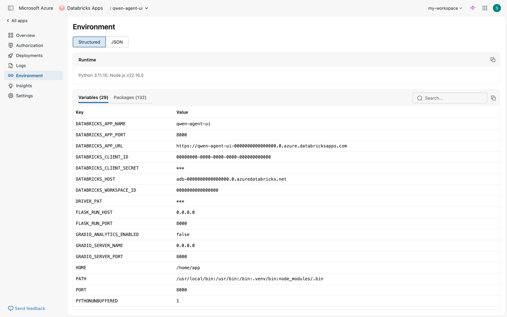

아래로 내리면 `VLLM_CLUSTER_ID`·`VLLM_MODEL`·`VLLM_PORT` 가 `app.yaml` 대로 들어가 있습니다.

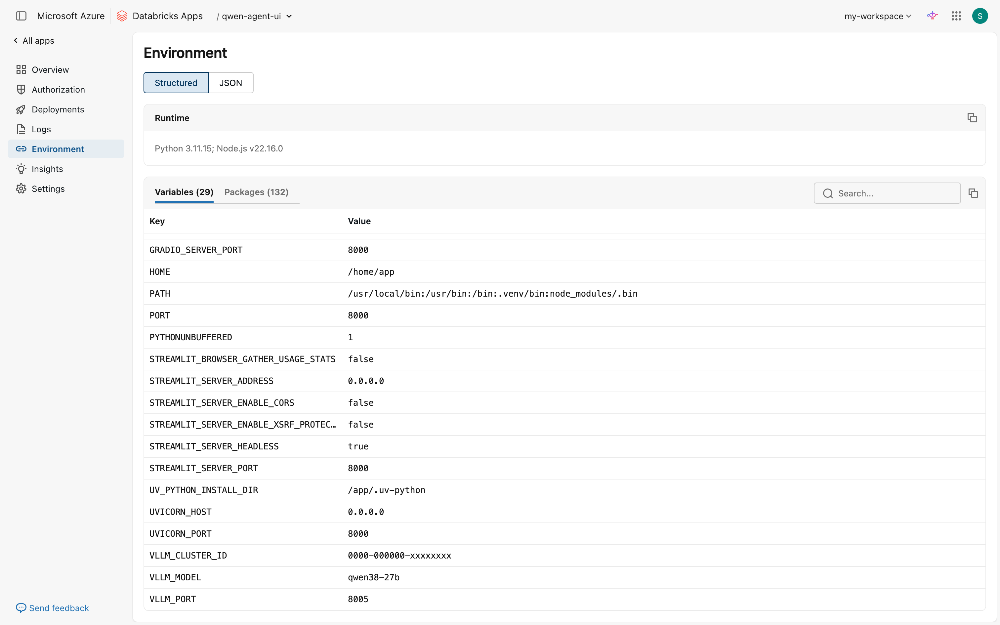

---

### 4-B. CLI 로 하기

#### 4-B.1 앱 생성 (실측 약 3분)

```bash
databricks apps create qwen-agent-proxy --profile <PROFILE>
```

생성이 끝나면 **앱 전용 서비스 프린시펄**이 함께 만들어집니다. 다음 단계에서 그 ID 가 필요합니다.

```bash
databricks apps get qwen-agent-proxy --profile <PROFILE> -o json \
  | python3 -c 'import json,sys; d=json.load(sys.stdin); print("SP :", d["service_principal_client_id"]); print("URL:", d["url"])'
```

#### 4-B.2 앱 SP 에 권한 두 개 주기

| 대상 | 권한 | 왜 |
|---|---|---|
| secret scope `qwen-agent` | `READ` | PAT 를 읽어야 합니다 |
| vLLM 클러스터 | `CAN_ATTACH_TO` | 예시 도구 `get_cluster_state` 가 `clusters/get` 을 호출합니다. 도구를 쓰지 않으면 생략 가능합니다 |

```bash
SP=<위에서 확인한 service_principal_client_id>

databricks secrets put-acl qwen-agent "$SP" READ --profile <PROFILE>

databricks permissions update clusters <클러스터ID> --profile <PROFILE> \
  --json "{\"access_control_list\":[{\"service_principal_name\":\"$SP\",\"permission_level\":\"CAN_ATTACH_TO\"}]}"
```

#### 4-B.3 secret 을 앱 리소스로 연결

`app.yaml` 의 `valueFrom: driver_pat` 은 **앱에 연결된 리소스 이름**을 가리킵니다. 연결하지 않으면
`DRIVER_PAT` 가 비어 있는 채로 앱이 뜨고, driver-proxy 호출이 전부 403 이 됩니다.

```bash
cat > /tmp/app_resource.json <<'JSON'
{"update_mask":"resources",
 "app":{"resources":[
   {"name":"driver_pat",
    "description":"driver-proxy 호출용 PAT",
    "secret":{"scope":"qwen-agent","key":"driver_pat","permission":"READ"}}]}}
JSON

databricks apps create-update qwen-agent-proxy --json @/tmp/app_resource.json --profile <PROFILE>
```

> ⚠️ **`update_mask: resources` 는 리소스 배열을 통째로 교체합니다.** 이미 다른 리소스를 붙여 두었다면
> 먼저 `databricks apps get` 으로 현재 목록을 읽어 **합쳐서** 보내십시오. 그러지 않으면 나머지가 떨어집니다.

#### 4-B.4 `app.yaml` 수정 후 업로드

`apps/agent_app/app.yaml` 의 `VLLM_CLUSTER_ID` 를 실제 클러스터 ID 로 바꾸십시오. 그 다음 두 파일을
워크스페이스로 올립니다(패키지 루트에서 실행).

**`<사용자>` 는 본인의 워크스페이스 사용자명입니다**(보통 로그인 이메일 전체). 아래로 확인하십시오 —
출력에 보이는 사용자명이 그 값이고, Workspace 화면의 홈 폴더 `/Users/…` 와 같습니다.

```bash
databricks current-user me --profile <PROFILE>
```

확인했으면 폴더를 만들고 두 파일을 올립니다.

```bash
databricks workspace mkdirs /Users/<사용자>/qwen_agent_app --profile <PROFILE>

for f in apps/agent_app/app.py apps/agent_app/app.yaml; do
  databricks workspace import --format RAW --overwrite \
    --file "$f" "/Users/<사용자>/qwen_agent_app/$(basename $f)" --profile <PROFILE>
done
```

> **`--format RAW` 를 빠뜨리지 마십시오.** 없으면 `app.py` 가 **노트북으로 임포트되고 확장자가 제거**되어
> 앱이 파일을 찾지 못합니다. 확인: `databricks workspace list /Users/<사용자>/qwen_agent_app -o json`
> 의 `object_type` 이 모두 **`FILE`** 이어야 합니다.

#### 4-B.5 배포

```bash
databricks apps deploy qwen-agent-proxy \
  --source-code-path /Workspace/Users/<사용자>/qwen_agent_app --profile <PROFILE>
```

`status.state` 가 **`SUCCEEDED`**, 메시지가 `App started successfully` 면 됩니다.
**코드를 수정할 때마다 4-B.4 업로드 → 4-B.5 배포**를 반복합니다(배포가 앱을 재시작합니다).

---

## 5. 확인

세 가지 방법이 있습니다. **판정은 5.1 로 합니다** — 나머지는 더 확인하고 싶을 때 씁니다.

| | 무엇 | 필요한가 |
|---|---|---|
| **5.1** | 앱의 자기시험 결과(T0~T5 · `verdict`) | **필수** — 이 문서의 완료 판정 근거입니다 |
| 5.2 | 검증 노트북으로 바깥에서 교차 검증 | 선택 |
| 5.3 | 브라우저로 앱을 열어 직접 써 보기 | 권장 — 앱을 실제로 쓸 사람이 확인 |

> **CLI 를 쓰지 않는 경우**: 5.1 의 같은 내용을 앱 화면의 **자기시험 결과** 버튼(§5.3)에서 볼 수 있습니다.
> 통과 기준표는 아래와 같으니, 어느 쪽으로 보든 기준은 동일하게 적용하십시오.

### 5.1 앱의 자기시험 — **필수** (CLI 로 회수)

앱은 기동 직후 **자기시험을 자동 실행**하고 결과를 워크스페이스 파일로 씁니다 — 브라우저로 앱에 접속하지
않고도 CLI 로 회수할 수 있습니다(통과하지 못하면 60초 간격으로 최대 20회 재시도합니다).

```bash
databricks workspace export /Shared/qwen_agent_selftest.json --profile <PROFILE> | python3 -m json.tool
```

| 항목 | 통과 기준 | 뜻 |
|---|---|---|
| `T0_egress_controls.denied_blocked` | `true` 또는 `false` | `true` = egress 정책이 강제 중(§10). `false` 는 실패가 아닙니다 |
| `T1_health` | **200** | driver-proxy 인증·네트워크 통과 |
| `T2_models` | **200** · `qwen38-27b` · `max_model_len` | 상류가 기대한 모델인지 |
| `T3_plain_chat` | **200** · `content` 가 비어 있지 않음 | 모델이 실제로 답한다 |
| **`T4_agent_tool_loop.ok`** | **`true`** · `steps` ≥ 2 | **도구 호출 루프가 돈다** — 1스텝에서 `tool_calls`, 2스텝에서 `finish_reason: stop` |
| **`T5_negative_404`** | **404 이면서 본문이 `{"detail":"Not Found"}`** | **음성 시험.** 앞단이 무조건 200 을 주는 것이 아니라 요청이 vLLM 까지 전달된다는 증거. **상태코드만 보면 안 됩니다** — 중간 계층이 만든 404 도 404 입니다 |
| `verdict` | `PASS_…` | `PASS_UNDER_ENFORCED_POLICY` 또는 `PASS_POLICY_NOT_ENFORCED_OR_FULL_ACCESS` |

**`T5` 를 건너뛰지 마십시오.** 200 만 보고 판정하면 프록시 계층이 상류를 보지 않고 200 을 돌려주는 경우를
걸러낼 수 없습니다(STEP0 §2.4 와 같은 이유입니다).

### 5.2 노트북으로 교차 검증 — 선택

앱의 자기시험은 **앱이 자기 자신을 시험한 것**입니다. 같은 다섯 항목을 **바깥에서 한 번 더** 돌려
교차 확인하려면 검증 노트북을 쓰십시오 — `notebooks/08_step4b_apps_agent.py` ([A3](appendix/A3_scripts_and_notebooks.md)).

**시간 제약**: 노트북의 앱 검증은 자기시험 파일이 **1시간** 안의 것일 때만 통과합니다(기본값 · 위젯으로 조절).
배포한 지 오래됐으면 같은 소스로 **다시 Deploy** 하면 갱신됩니다.

**넣는 방법**: §4-A.2 와 **똑같은 Import** 로 올립니다 — 단 **앱 소스 폴더가 아닌 다른 위치**에 두십시오
(앱 폴더에 두면 다음 배포가 이 노트북까지 복사합니다 — 사용자 홈을 권합니다). 이 파일은 **NOTEBOOK 으로
들어옵니다.** 그 다음 **vLLM 이 도는 GPU 클러스터에 연결(Connect)** 하고 **Run all**.

| 위젯 | 기본값 |
|---|---|
| `cluster_id` | vLLM 이 도는 클러스터 ID |
| `port` | `8005` |
| `secret_scope` · `secret_key` | `qwen-agent` · `driver_pat` |
| `app_name` | UI 로 만든 앱 이름 |

노트북이 하는 일과 **하지 않는 일**:

- **하는 일** — secret 에서 PAT 를 읽어(값은 출력하지 않습니다) driver-proxy 로 **T1 `/health` · T2 `/v1/models` ·
  T3 단발 대화 · T4 도구 호출 루프 · T5 음성 404** 를 직접 실행하고, 앱이 쓴 자기시험 JSON 을 읽어 교차 검증한 뒤
  증거 파일 하나를 `/Shared/step4b_evidence_<UTC>.json` 으로 남깁니다. **앱의 시험과 항목은 같지만 완전히 같은
  요청은 아닙니다** — 노트북은 추론 예산을 더 주고, 도구 인자 파싱과 제공하지 않은 도구 호출까지 확인합니다.
- **하지 않는 일** — **PAT 발급**(노트북 컨텍스트 토큰이 되어 앱에서 403 · §3), 앱 생성·배포,
  그리고 **T0(egress 대조군)**. T0 을 노트북에서 재면 안 됩니다 — egress 정책은 **serverless** 워크로드에 걸리고
  이 노트북은 **classic** 클러스터에서 돕니다. 노트북이 통과해도 앱(serverless)은 막힐 수 있어 **거짓 통과**가 됩니다.

**먼저 — 위젯 값을 채우십시오.** 자리표시자(`<클러스터ID>`·`<앱이름>`)를 그대로 두고 `Run all` 하면
셀 2 에서 `ValueError` 로 멈춥니다. 값 없이 조용히 진행해 엉뚱한 대상을 검사하는 것을 막는 가드입니다.

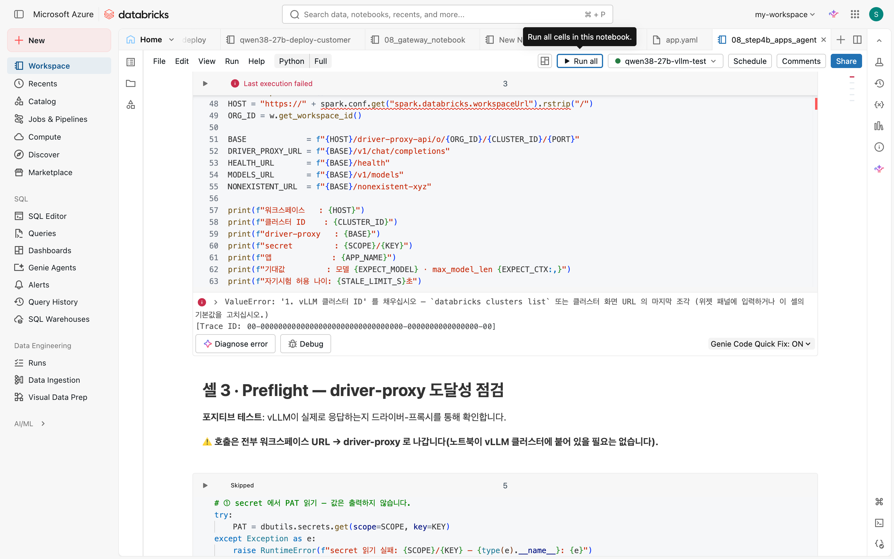

**셀 3 — preflight**: PAT 가 노트북 컨텍스트 토큰이 아닌지 확인하고, driver-proxy 도달성과
**모델 이름·`max_model_len` 이 기대값과 같은지**까지 봅니다.

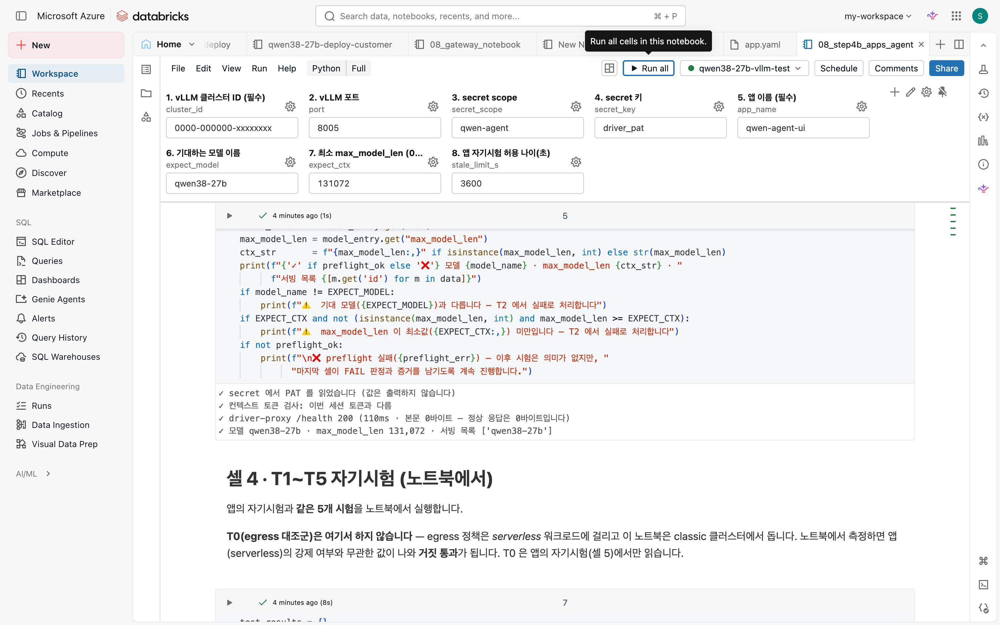

**셀 4 — T1~T5**: `/health` 200 · `/v1/models` 200(모델 이름·`max_model_len` 을 기대값과 대조) ·
단발 대화 200 · **도구 루프 2스텝**(1스텝 도구 2개 → 2스텝 `stop` · 도구 인자 파싱 확인) ·
**음성 시험 404 + 본문이 정확히 `{"detail":"Not Found"}`**.

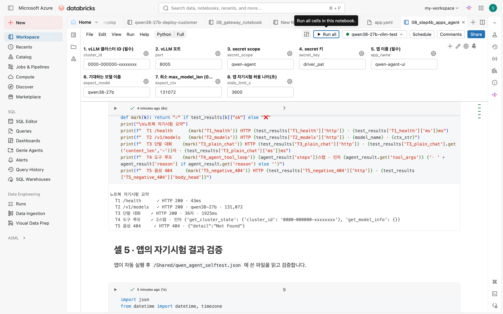

**셀 5 — 앱 결과 교차 검증**: 앱이 쓴 JSON 을 읽어 `verdict`·T4·T5 와 **파일 신선도**, 그리고
**그 파일이 정말 이 앱의 것인지**(모델·클러스터 대조 · 앱 상태 `RUNNING`)를 봅니다.

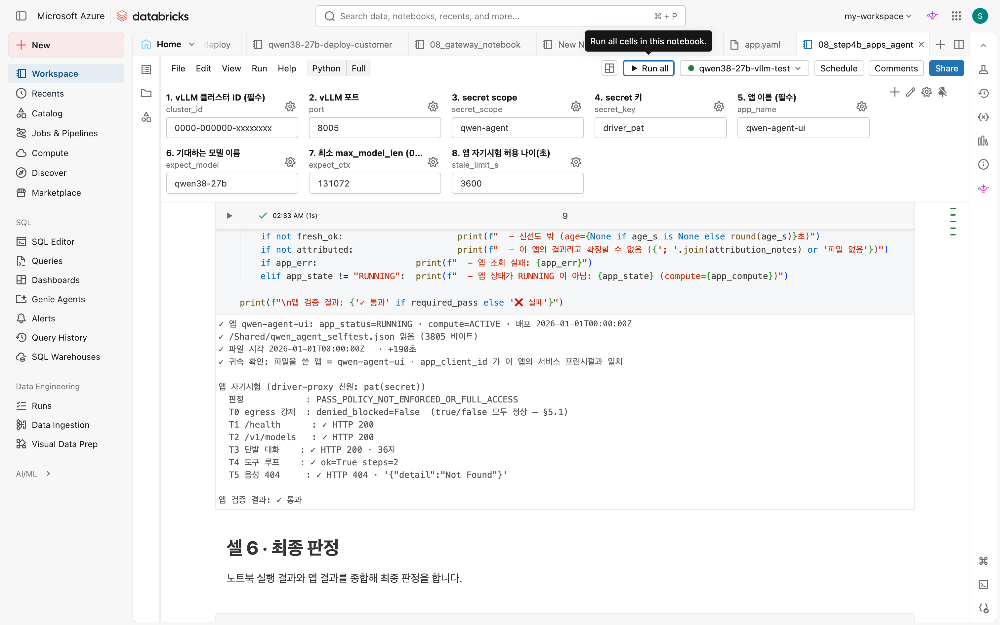

> ⚠️ **두 가지를 꼭 보십시오(노트북이 대신 봅니다).**
> ① **신선도** — 앱은 **통과할 때까지만** 자기시험을 재시도하므로 통과 후에는 파일이 갱신되지 않습니다.
> 그래서 **지난 배포의 `PASS` 를 지금의 증거로 오독하기 쉽습니다.** 노트북은 기본 **1시간**을 넘긴 파일과
> **미래 시각** 파일을 모두 실패로 처리합니다. 갱신은 같은 소스로 **다시 Deploy**.
> ② **귀속** — 자기시험 경로 `/Shared/qwen_agent_selftest.json` 은 **앱마다 공유됩니다.** 앱이 둘이면
> 서로 덮어쓰므로, 이 파일이 지금 검사하는 앱의 것인지 **모델·클러스터로 대조**해야 합니다(§8).

**셀 6 — 최종 판정**: 노트북 5개 + 앱 결과를 합쳐 한 줄로 판정하고 증거 파일을 씁니다.
통과하면 **`PASS_NOTEBOOK_AND_APP`** 이 나옵니다.

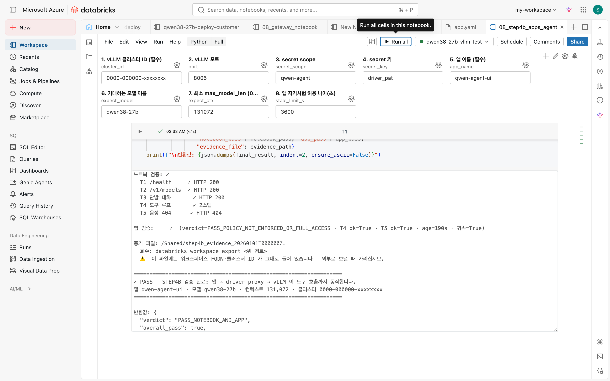

> **`notebook_pass` 에는 T5 가 포함되어 있습니다.** T5 를 빼고 200 만 보면, 앞단이 상류를 보지 않고 200 을
> 돌려주는 구성에서도 PASS 가 나옵니다 — 이 문서가 §5.1 에서 경고하는 바로 그 상황입니다.

---

### 5.3 화면에서 확인 — 권장

앱 URL 을 브라우저로 열면 **처음 한 번은 사용자 동의 화면**이 뜹니다(`Permission Requested` ·
`This app is requesting permission to act on your behalf`). **Authorize** 를 누르면 들어갑니다.
Apps 는 이 동의를 사용자별로 받으므로 **PAT·Azure AD 토큰으로는 앱 화면을 부를 수 없습니다.**

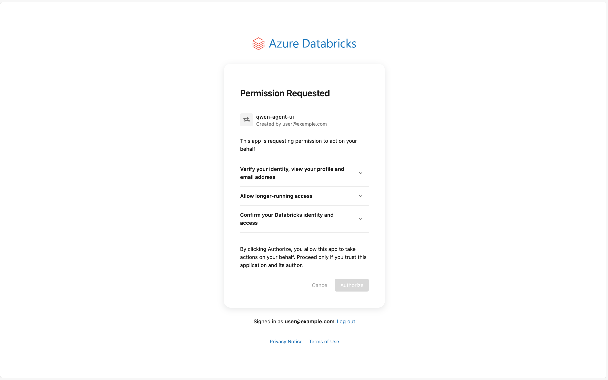

들어가면 버튼 4개가 있습니다.

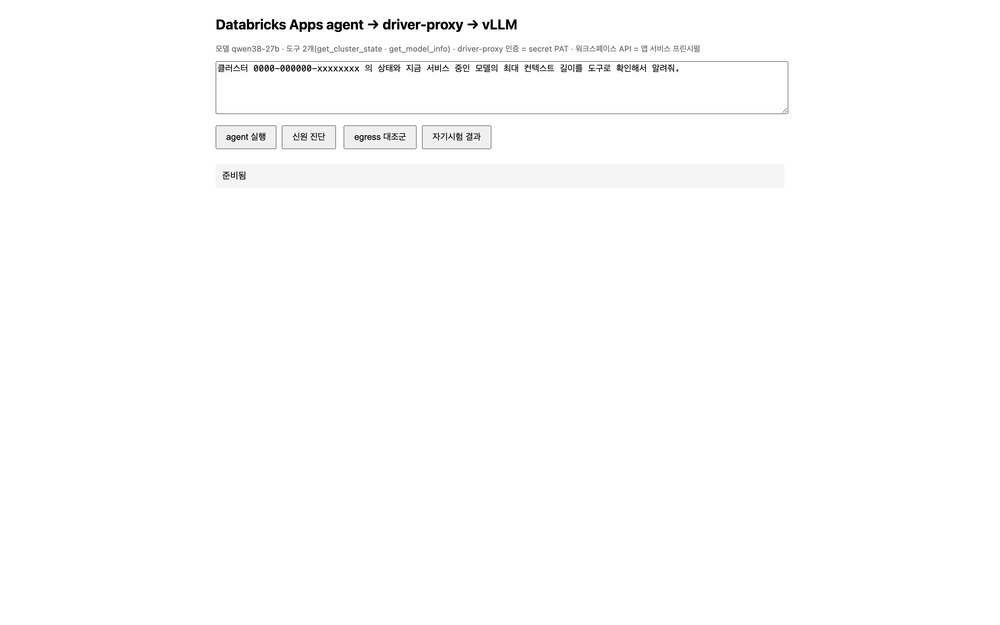

| 버튼 | 무엇을 봅니까 |
|---|---|
| **agent 실행** | 도구 호출 루프의 전체 trace(스텝별 지연·토큰·도구 결과) |
| **신원 진단** | §2 의 표를 지금 환경에서 재현합니다 — 403 이 나올 때 원인을 바로 가릅니다 |
| **egress 대조군** | 허용/미허용 도메인 호출 결과(정책 강제 여부) |
| **자기시험 결과** | §5.1 의 JSON 과 같은 내용 |

**agent 실행** — **2스텝 · 약 6초**. 1스텝에서 도구 2개(`get_cluster_state`·`get_model_info`)를
호출하고 2스텝에서 `finish_reason: stop` 으로 한국어 답을 냈습니다.

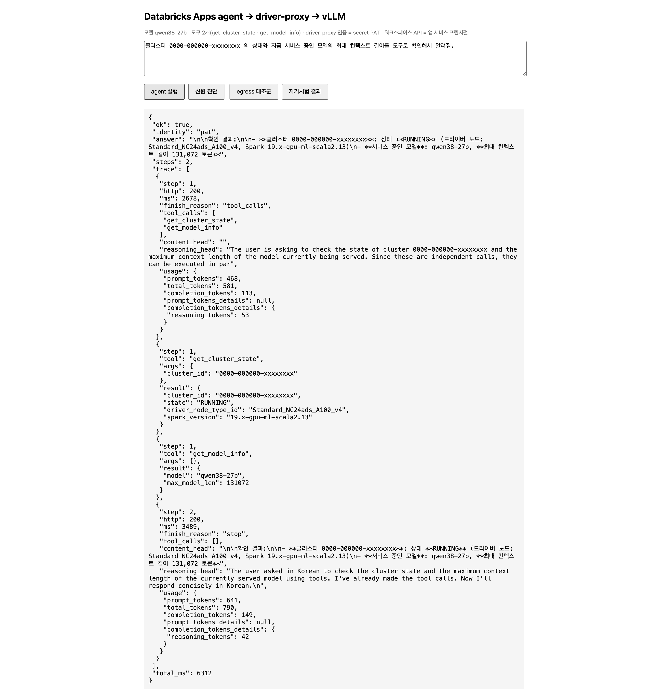

**신원 진단** — §2 의 표가 **새로 만든 앱에서 그대로 재현**됐습니다.
앱 SP **403**(`Single-user check failed`) · **PAT 200**(100 ms) · 사용자 OBO **403**(스코프 `clusters` 요구).

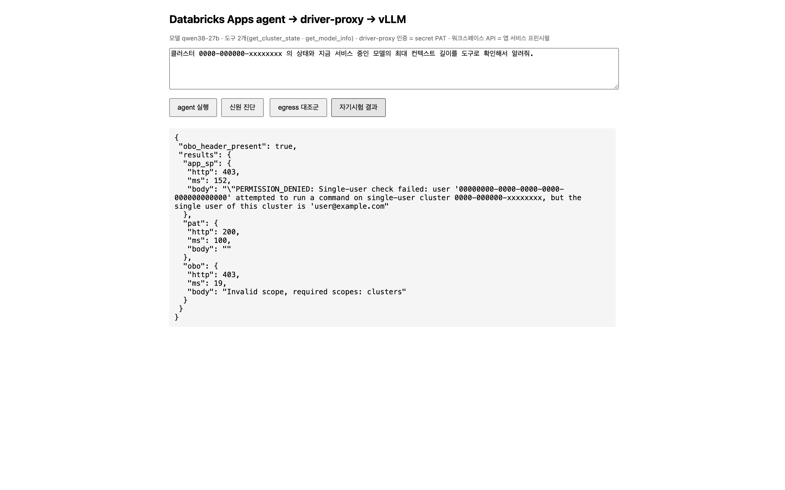

**자기시험 결과** — `verdict` 와 T0~T5 전체.

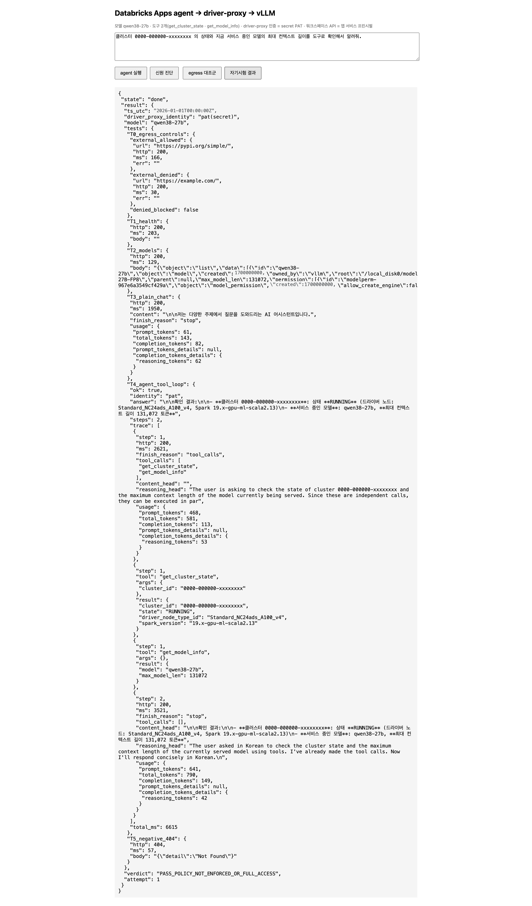

---

## 6. 참고 성능값 (A100 80GB × 1 · `qwen38-27b` · 131,072)

이 패키지의 `apps/agent_app/` 파일을 그대로 배포해 측정한 값입니다. 판정 기준이 아니라 **참고값**입니다 —
환경에 따라 달라집니다.

| 항목 | 값 |
|---|---|
| 앱 생성(컴퓨트 프로비저닝) | 약 **3분** (화면 안내는 `2-3 minutes`) |
| 소스 업로드 | 즉시 |
| 배포 (`Deploy` → `SUCCEEDED`) | **5~6초** (앱 재시작 포함) |
| driver-proxy `/health` | **200** · 40~300 ms |
| `/v1/models` | **200** · 40~180 ms |
| 단발 대화(짧은 질문) | **200** · 약 **2초** |
| **도구 호출 agent 루프** | **2스텝 · 5.6~8.8초** (1스텝에서 도구 2개 → 2스텝 `finish_reason: stop`) |
| 음성 시험 `/nonexistent-xyz` | **404** · 45~175 ms · 본문 `{"detail":"Not Found"}` |
| 앱 자기시험 `verdict` | `PASS_POLICY_NOT_ENFORCED_OR_FULL_ACCESS` (egress 정책이 강제되지 않는 환경) |

**도구 루프는 어느 경로에서도 2스텝**이었습니다(UI 로 만든 앱과 CLI 로 만든 앱 모두). PAT scope 는
`clusters` 하나였습니다(§3.2).

**vLLM 콜드 기동은 위 시간에 포함되지 않습니다** — 같은 vLLM 프로세스를 재사용한 값입니다.
콜드 기동은 **280~320초**입니다([STEP3](STEP3_vllm_serve.md) §6).

---

## 7. 반드시 지켜야 할 3가지

vLLM 기동 조건(`--host 0.0.0.0` · `--api-key` 금지 · tool calling 플래그)은 전제이므로
[STEP3](STEP3_vllm_serve.md) 에서 이미 맞춰져 있습니다. 이 단계에서 새로 지켜야 할 것은 아래 셋입니다.

| # | 지켜야 할 것 | 지키지 않으면 |
|---|---|---|
| 1 | driver-proxy 인증은 **PAT** 로 (앱 SP·OBO 아님) | 각각 **403** — §2 |
| 2 | secret 리소스의 **`Resource key`** = `app.yaml` 의 **`valueFrom`** 값 (UI 기본값은 `secret`) | `DRIVER_PAT` 가 빈 문자열이 되어 앱이 **자기 SP 신원**으로 호출 → 전부 **403** `Single-user check failed`. 앱은 정상 기동하므로 화면만 보면 모릅니다 |
| 3 | 클러스터 **`autotermination_minutes: 0`** 을 검토 | 종료되면 앱은 계속 `RUNNING` 인데 호출은 전부 실패하고, `/local_disk0` 이 비워져 venv·가중치·serve 를 다시 올려야 합니다. 추론 트래픽이 종료 타이머를 갱신한다고 가정하지 마십시오 |

> **3번을 나중에 바꾸면 `databricks clusters edit` 가 클러스터를 재시작합니다.** 클러스터를 만들기 전에
> 정하십시오([STEP2](STEP2_cluster_and_runtime.md) §1).

---

## 8. 문제 해결

| 증상 | 원인 | 확인 | 조치 |
|---|---|---|---|
| `403 Single-user check failed` | 앱 **SP 신원**으로 호출됨 = PAT 가 주입되지 않음 | 자기시험의 `driver_proxy_identity` 가 `app_sp` 인지 · 화면의 **신원 진단** | §4-A.1(UI) 또는 §4-B.3(CLI) 의 secret 리소스 연결 · `app.yaml` 의 `valueFrom: driver_pat` · scope ACL(`READ`) |
| `403 … required scopes: clusters` | **OBO 토큰**으로 호출됨 | 요청 URL 에 `identity=obo` 가 붙었는지 | 기본 신원(PAT)으로 호출하십시오. 이 스코프는 **열 수 없습니다**(§2) |
| **401** | PAT 만료 · 무효 | `databricks tokens list` 에서 만료 확인 | §3 을 다시 실행해 secret 을 덮어쓰고 **앱을 재배포**(재시작해야 새 값을 읽습니다) |
| `400 INVALID_STATE: Cluster … Terminated` | 클러스터 종료 | `databricks clusters get` | 클러스터 시작 후 **serve 재기동**([STEP3](STEP3_vllm_serve.md)) — `/local_disk0` 이 비워졌으므로 [STEP1·STEP2](STEP2_cluster_and_runtime.md) 도 다시 |
| **502** | vLLM 이 `127.0.0.1` 로 떴거나 죽음 | 드라이버에서 `curl http://127.0.0.1:8005/health` · `ps -eo args \| grep 'vllm serve'` | `BIND_HOST=0.0.0.0` 으로 재기동 |
| **400** `"auto" tool choice requires …` | tool calling 플래그 없이 기동 | serve 명령줄 확인 | `TOOL_CALL_PARSER=qwen3_xml` 로 재기동 |
| 답이 비고 `finish_reason: length` | **추론 토큰이 예산을 다 씀** | 응답의 `usage.completion_tokens_details.reasoning_tokens` | `max_tokens` 를 늘리십시오(이 앱 기본값은 **1,500** 으로 올렸습니다 — 900 이던 시절 이 증상이 재현됐습니다). 성능 보고서 [P2](../performance/P2_agent_workload.md) 참조 |
| 앱은 `RUNNING` 인데 화면이 안 뜸 | 포트 바인딩 | 앱 로그 | `DATABRICKS_APP_PORT` 와 `0.0.0.0` 을 쓰는지(이 앱은 이미 그렇습니다) |
| `databricks apps logs` 가 websocket 302 | 해당 명령은 **OAuth 인증만** 지원 | 프로파일 종류 | `databricks auth login` 으로 만든 프로파일을 쓰십시오. 또는 자기시험 파일(§5)로 대체 |
| 앱은 `RUNNING` 인데 **모든 호출이 403** `Single-user check failed` | secret 리소스의 `Resource key` 가 `valueFrom` 과 다름(UI 기본값 `secret`) | **Environment** 탭에 `DRIVER_PAT` 이 있는지 · 앱 화면 **신원 진단** 의 `pat` 항목 | `Resource key` 를 `driver_pat` 으로 고치고 **재배포** (§4-A.1) |
| 앱 URL 이 `Permission Requested` 에서 멈춤 | Apps 는 **사용자별 OAuth 동의**를 받습니다 | 화면의 `Authorize` 버튼 | 눌러서 동의하십시오. **PAT·Azure AD 토큰으로는 앱 화면을 부를 수 없습니다**(§5.3) |
| 자기시험 JSON 이 **다른 앱 결과**로 보임 | 앱이 둘 이상이면 **같은 `/Shared/qwen_agent_selftest.json` 에 서로 덮어씁니다** | JSON 의 `ts_utc` 와 배포 시각 대조 | 앱마다 경로를 다르게 하거나(앱 코드 수정), 판정 직전에 **그 앱만 재배포**해 파일을 갱신하십시오 |
| 파일 편집이 앱에 반영되지 않음 | 배포는 그 시점의 **복사본** | `Source` 경로와 배포 시각 | 파일을 고친 뒤 **다시 Deploy** (§4-A.5) |
| UI 에 배포 버튼이 없거나 폴더 배포가 거부됨 | 관리자가 **Only allow app deployments from Git** 를 켜 둠 | Settings → Development → Apps | Git 소스로 배포하십시오(§4-A.3 주석) |

---

## 9. 정리 (쓰지 않을 때)

```bash
databricks apps delete <앱이름> --profile <PROFILE>                     # 앱(과 전용 SP)
databricks workspace delete /Users/<사용자>/<앱소스폴더> --recursive --profile <PROFILE>
databricks workspace delete /Shared/qwen_agent_selftest.json --profile <PROFILE>
databricks workspace delete /Shared/step4b_evidence_<UTC>.json --profile <PROFILE>   # 검증 노트북 증거
databricks secrets delete-secret qwen-agent driver_pat --profile <PROFILE>
databricks tokens list --profile <PROFILE>                             # 해당 token_id 확인 후
databricks tokens delete <TOKEN_ID> --profile <PROFILE>                # 위치 인자입니다(--token-id 아님)
databricks clusters delete <클러스터ID> --profile <PROFILE>            # 클러스터 종료(terminate 서브커맨드는 없습니다)
```

UI 로 지우려면 앱 화면 오른쪽 위 **⋮ → Delete**, 잠시 멈추려면 같은 메뉴의 **Stop** 입니다.

**앱을 삭제하면 전용 서비스 프린시펄도 삭제됩니다.** 앱을 지우지 않고 잠시 멈추려면
`databricks apps stop <앱이름>` 을 쓰십시오.

---

## 10. serverless egress 가 제한된 워크스페이스에서

계정의 network policy 가 `RESTRICTED_ACCESS` 이고 dry-run 이 **제품별**(`Databricks SQL` ·
`AI model serving`)로만 걸려 있는 구성 — 즉 **Apps 는 강제 대상** — 에서 같은 창에 두 경로를 나란히
측정했습니다.

| 경로 | 결과 |
|---|---|
| **AI Gateway external model → driver-proxy** (STEP4) | **차단** `CUSTOMER_UNAUTHORIZED … denied because of serverless network policy` (2회) |
| 앱에서 허용 목록 도메인 | 200 (양성 대조군) |
| 앱에서 **미허용** 도메인 | **DNS 해석 실패** (음성 대조군 = 강제되고 있음의 증거) |
| **앱 → driver-proxy → vLLM** (이 문서) | **동작** — `/health` 200 · 단발 대화 200 · **도구 호출 루프 2스텝 성공** · 음성 시험 404 |

**즉 정책을 하나도 바꾸지 않고 이 경로로 갈 수 있습니다.** 판정할 때 두 가지를 지키십시오.

- **강제 반영을 기다리십시오.** 정책 부착 후 게이트웨이 차단은 **3분 29초**, **Apps 강제는 7분 40초**에
  관측됐습니다(다른 관측에서는 약 15분). 앱 재시작도 필요합니다  
- **음성 대조군 없이 판정하지 마십시오.** 강제 전에 측정하면 "통과"로 보입니다 — 실제로 부착 3분 뒤
  측정에서 미허용 도메인이 200 으로 통과하는 **거짓 통과**를 관측했습니다. 그래서 이 앱은 `denied_blocked`
  를 함께 보고합니다(§5 `T0`)

**남은 제약**: 공식 Apps 네트워킹 문서는 restricted 정책에서 `*.databricksapps.com` 을 허용 목록에 넣으라고
안내하지만 **API 가 와일드카드를 거부**합니다(`not a valid hostname`). 시험 중 앱 접속은 정상이었으나
장기 영향은 확인하지 못했습니다. 배경과 다른 선택지는 [부록 A4](appendix/A4_serverless_egress_allowlist.md) §10 에 있습니다.

---

## 11. 확인하지 못한 항목

이 절차는 아래를 검증하지 않았습니다. 해당되는 환경이면 **직접 확인하십시오.**

| 항목 | 이유 | 위험도 |
|---|---|---|
| **egress 가 제한된 워크스페이스에서 UI 경로** | 제한 환경의 근거는 §10 이고, 그때는 CLI 로 만든 앱이었습니다. UI 로 만든 앱은 정책이 강제되지 않는 환경에서만 확인했습니다 | **중** — §10 의 두 대조군(허용/미허용 도메인)으로 직접 판정하십시오 |
| **수명이 30일 이상인 PAT** | 1일 토큰으로만 검증했습니다. 장수명 토큰의 auto-scoping 거동은 확인하지 않았습니다 | **중** — 운영 토큰은 짧게 두고 회전하십시오(§3.3) |
| **이미 있는 앱에 secret 리소스를 나중에 추가할 때의 ACL** | 앱 생성 시점만 확인했습니다 | 낮음 — `databricks secrets list-acls qwen-agent --profile <PROFILE>` 로 `READ` 유무를 보고, 없으면 §4-B.2 |
| **`Resource key` 를 틀리게 두었을 때의 403** | §8 의 해당 행은 앱 코드 동작과 §2 의 403 에서 연역한 것입니다 | 낮음 — 증상이 나오면 §8 의 조치를 그대로 적용하십시오 |
| **앱 컴퓨트가 `ACTIVE` 가 되는 정확한 시간** | 화면 안내(`2-3 minutes`)와 관측값 약 3분만 근거입니다 | 낮음 |

---

## 12. 참고 — driver-proxy 신원별 응답

§2 의 근거입니다. **403 이 났을 때 원인을 가리는 데 쓰십시오** — 절차를 따라가는 중에는 읽을 필요가 없습니다.
앱 화면의 **신원 진단** 버튼이 이 세 줄을 지금 환경에서 다시 찍어 줍니다(§5.3).

| 신원 | `/health` 응답 | 왜 |
|---|---|---|
| 앱 **서비스 프린시펄** OAuth(런타임이 자동 주입) | **403** `PERMISSION_DENIED: Single-user check failed: user '<앱 SP>' attempted to run a command on single-user cluster <클러스터ID>, but the single user of this cluster is '<사용자>'` | 클러스터의 `single_user_name` 과 **신원이 다릅니다.** `CAN_ATTACH_TO` 를 줘도 통과하지 않습니다 — 권한 검사가 아니라 신원 검사입니다 |
| **사용자 OBO** 토큰(`x-forwarded-access-token`) | **403** — 스코프 `clusters` 를 요구합니다(문구는 조금씩 다를 수 있습니다: `Provided OAuth token does not have required scopes: clusters` / `Invalid scope, required scopes: clusters`) | driver-proxy 는 `clusters` 스코프를 요구하는데, **Apps 의 `user_api_scopes` 에는 그 값이 없습니다.** API 가 `not a valid scope` 로 거부하며, 워크스페이스 허용목록을 `["*"]` 로 두어도 열리지 않습니다 |
| **클러스터 single user 의 PAT**(secret 주입) | **200** | **이 방법으로만 통과합니다.** 이 문서가 PAT 를 쓰는 이유입니다 |

> **클러스터가 꺼져 있으면 이 403 이 보이지 않습니다.** 종료 상태에서는 driver-proxy 가 **인증 검사 전에**
> `HTTP 400 INVALID_STATE: Cluster … is in Terminated state` 를 돌려줍니다. 이 400 을 "경로가 열려 있다"고
> 읽으면 오판입니다. **반드시 클러스터를 기동한 상태에서 판정하십시오.**

---

## 참고

- 앱 코드 — `apps/agent_app/app.py` · `apps/agent_app/app.yaml` ([A3](appendix/A3_scripts_and_notebooks.md))
- 검증 노트북 — `notebooks/08_step4b_apps_agent.py` (§5.2)
- 이 문서의 화면 캡처 원본 — `deployment/images/`
- 게이트웨이 경로 — [STEP4_ai_gateway.md](STEP4_ai_gateway.md)
- 증상별 문제 해결 — [부록 A2](appendix/A2_troubleshooting.md)
- egress 정책 배경 — [부록 A4](appendix/A4_serverless_egress_allowlist.md)
- 모델 특성(추론 폭주 · tool 강제 무시 · 한국어 토큰 비용) — [성능 보고서 P2](../performance/P2_agent_workload.md)

**다음 단계**: 앱이 통과했으면 [STEP5_test.md](STEP5_test.md) 의 품질·동시성 검증을 하십시오
(엔드포인트 URL 대신 앱의 driver-proxy URL 로 호출하면 같은 시험을 그대로 쓸 수 있습니다).
